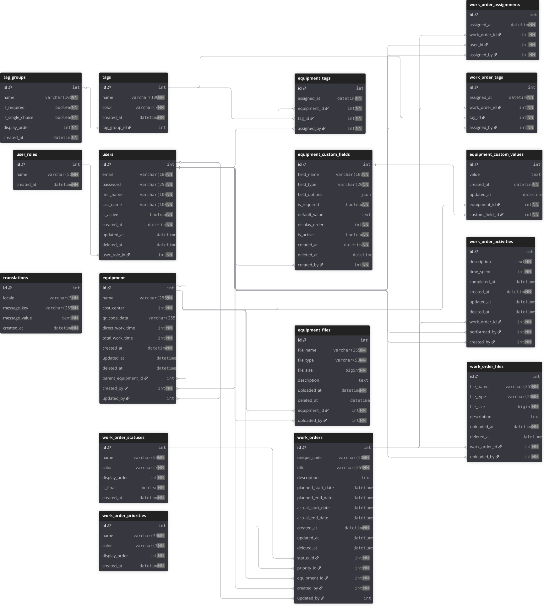

# 📊 Database Schema Documentation

## Entity-Relationship Diagram



---

## Files

| File | Purpose |
|------|---------|
| **`schema.svg`** / **`ERD.svg`** | Visual diagram (open in browser) |
| **`schema.dbml`** | Editable source for [dbdiagram.io](https://dbdiagram.io/d) |
| **`schema.puml`** | PlantUML source (VS Code: `Alt+D` to preview) |

---

## Database Overview

- **Total Tables:** 20
- **Normalization:** 3NF
- **ORM:** Doctrine 3.x (Symfony 7.3)
- **DBMS:** MySQL 8.4

---

## Schema Modules

### 🟢 User Management (2 tables)
- **`user_roles`** - Role definitions (admin, manager, technician, provider, reporter)
- **`users`** - System users with JWT authentication

### 🔵 Equipment Management (7 tables)
- **`equipment`** - Equipment registry with hierarchy (`parent_equipment_id`)
- **`tag_groups`** / **`tags`** - Categorization system
- **`equipment_tags`** - Equipment ↔ Tags (many-to-many)
- **`equipment_custom_fields`** / **`equipment_custom_values`** - EAV pattern for dynamic fields
- **`equipment_files`** - File attachments

### 🟠 Work Order Management (7 tables)
- **`work_order_statuses`** / **`work_order_priorities`** - Dictionaries
- **`work_orders`** - Maintenance requests with unique codes (WO-XXXXXXXX)
- **`work_order_assignments`** - Users ↔ Work Orders (many-to-many)
- **`work_order_tags`** - Work Orders ↔ Tags
- **`work_order_activities`** - Activity log with time tracking
- **`work_order_files`** - File attachments

### 🟣 System (4 tables)
- **`translations`** - i18n messages (PL/EN/DE)
- **`audit_logs`** - Audit trail for all entity changes
- **`reports`** - Async report generation queue (Symfony Messenger)
- **`notifications`** - In-app notifications for users

---

## Key Design Patterns

### Soft Delete
Tables with `deleted_at` column: `users`, `equipment`, `work_orders`, files, activities.
- Records are marked as deleted, not physically removed
- Enables data recovery and audit trail

### Audit Trail
Most tables track:
- `created_by` / `updated_by` / `assigned_by` → `users.id`
- `created_at` / `updated_at` / `assigned_at` timestamps

### Hierarchical Equipment
`equipment.parent_equipment_id` → `equipment.id` (self-reference)
- Example: Server rack → Individual servers

### EAV Pattern
`equipment_custom_fields` + `equipment_custom_values`
- Add custom fields without schema changes
- Example: Serial number, license plate, warranty date

---

## Working with Schema

### Update database from entities
```bash
php bin/console doctrine:migrations:diff
php bin/console doctrine:migrations:migrate
```

### Update ERD after changes
1. Edit `schema.dbml`
2. Paste into https://dbdiagram.io/d
3. Export as SVG → save as `schema.svg`

---

## Contributing

When modifying schema:
1. Update entities (`src/Entity/*.php`)
2. Generate migration (`doctrine:migrations:diff`)
3. Update ERD files (`schema.dbml` + `schema.puml`)
4. Export new SVG
5. Commit together

---

**Framework:** Symfony 7.3 + Doctrine ORM + MySQL 8.0
